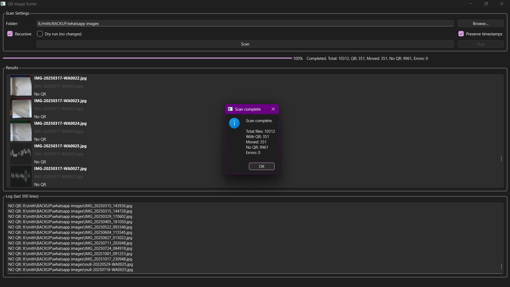
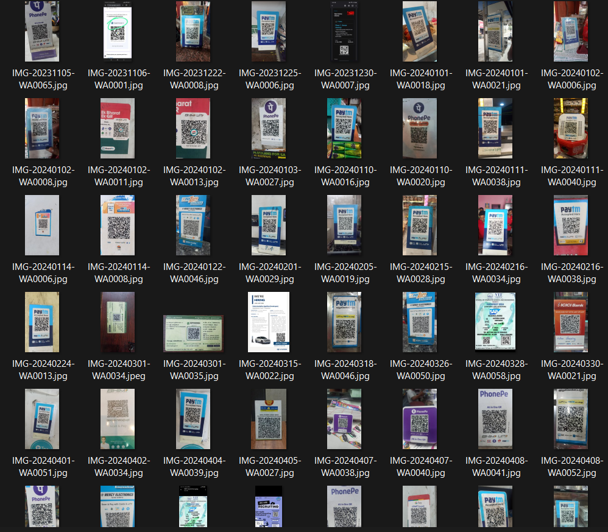

# QR Code Sorter

Simple tool to scan images for QR codes and organize them automatically.

## What it does

Scans through image files in a folder, detects QR codes, and moves images containing QR codes into a `qr` subfolder within each directory.

## Requirements

- Python 3.10 or higher
- PyQt6
- pyzbar
- Pillow
- zbar library (system dependency)

## Installation

Install Python packages:

```
pip install PyQt6 pyzbar Pillow
```

Install zbar:

- Windows: Download from zbar website or use vcpkg
- macOS: `brew install zbar`
- Linux: `sudo apt-get install libzbar0` (or equivalent for your distro)

## Usage

Run the GUI:

```
python qr_sorter_gui.py
```

Select a folder to scan. Options:

- Recursive: scan subfolders
- Dry run: preview without moving files
- Preserve timestamps: keep original file timestamps

## How it works

The app scans image files (jpg, png, etc.) and checks for QR codes. If found, the image is moved to a `qr` folder in the same directory as the original file. Logs are written to `qrscan.log` files.






## Files

- `qr_sorter_gui.py` - main GUI application
- `qr_scanner_core.py` - core scanning logic
